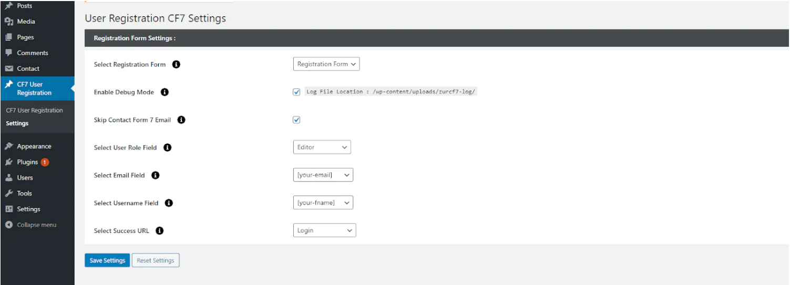
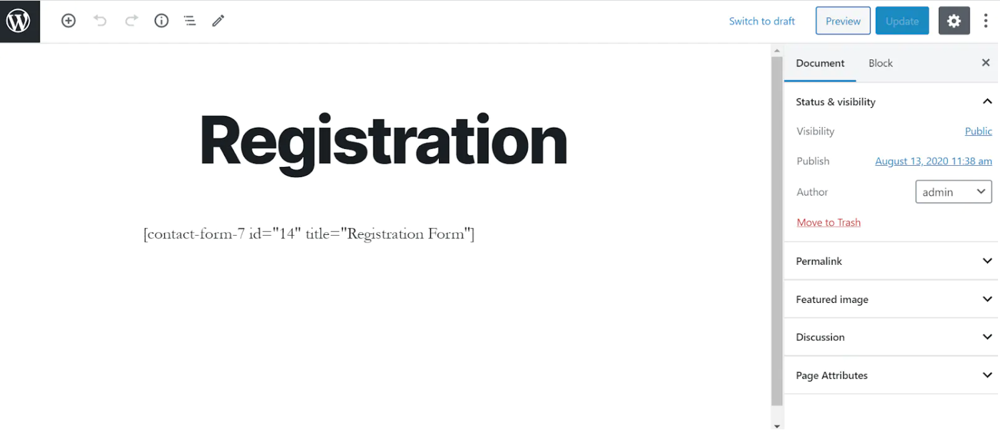
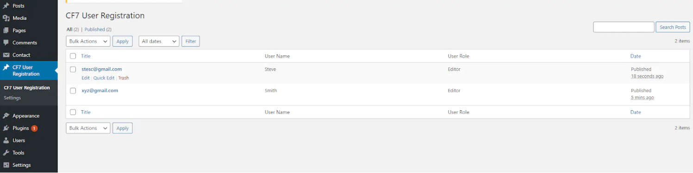
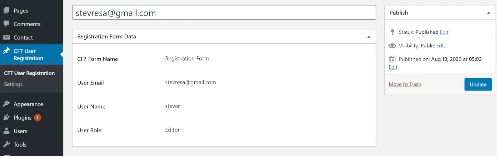

# User Registration Using Contact Form 7 
User Registration Using Contact Form 7 plugin provides the feature to register the user to the website. By using this plugin, it becomes easy to create the registration or sign up form by selecting the fields for username and Email Id. The plugin allows the admins to view the list of registered users and set their roles efficiently.

**Features of User Registration Using Contact Form 7**

- Advanced Custom Field Mapping: Create advanced custom fields for user profiles, with only text and textarea options, and map them to corresponding Contact Form 7 fields. This allows for a more personalized user experience.
- Social Sign Up : Enable users to sign up in using popular social media platforms such as Facebook.
- Option to include the login URL in the email.
- Users can register to the site using the Contact Form 7 plugin.
- Option to view the list of the users who have been registered to the site.
- Option to set the User Role for the registered users.
- Option to select the Username and email field for the registration.
- An email consisting of an auto-generated password will be sent to the users after their registration is completed on the site.
- There is a debug mode option for debugging.
- Option to set a URL to redirect users to a particular page after a user is registered.

[Learn more about the Pro version](https://store.zealousweb.com/wordpress-plugins/user-registration-using-contact-form-7-pro)

**Features of User Registration Using Contact Form 7 Pro**

- BuddyPress Profile Field Mapping: Mapping field This should include a dropdown list showing all BP profile fields. This mapping can be saved and reused across multiple forms.
- Custom Field Mapping for BuddyPress Profiles: Custom fields (text, textarea) are mapped in a dedicated section for advanced users.
- BuddyPress Activity Stream Integration: An option allows admins to enable or disable logging of user registration and profile updates to the BuddyPress activity stream.
- Users can also login using the Contact Form 7 plugin.
- Woocommerce field integration for the users to collect the data.
- Custom validation message for reset password and forgot password.
- Shortcode for forgot password and reset password.
- Email SMTP settings.
- Admins can restrict users from login.
- Auto login after user registration.
- Option to add a password field to the Contact Form 7 plugin.
- Social Sign Up + Login: Enable users to sign up and log in using popular social media platforms such as Google, Facebook, and Apple.
- Push Notifications: Set up push notifications to be sent to registered users on your site, keeping them informed and engaged.
- Compatibility with Multi-Step for Contact Form 7: Ensure seamless integration between Contact Form 7 and the Multi-Step extension, allowing you to create intuitive and user-friendly multi-step forms.
- Email Templates for Contact Form 7: Customize email templates for Contact Form 7 or bypass the default email notifications entirely. This allows you to send personalized registration and login email notifications.
- Multilingual Support: Provide support for multiple languages on your site, enabling users to view and interact with content in their preferred language.
- Advanced Custom Field Mapping: Create advanced custom fields for user profiles, with only text and textarea options, and map them to corresponding Contact Form 7 fields. This allows for a more personalized user experience.
- WooCommerce Field Mapping
- Compatibility of WordPress VIP.

# PLUGIN REQUIREMENT
- PHP version : 5.4 and latest
- WordPress : WordPress 3.0 and latest

# Installation
Installing the plugin is easy. Just follow these steps:

- From the dashboard of your site, navigate to Plugins –> Add New.
- Select the Upload option and hit “Choose File.”
-  When the popup appears, select the contact-form-7-stripe-addon.zip file from your desktop.
- Follow the on-screen instructions and wait till the upload completes.
- When it’s finished, activate the plugin via the prompt. A message will display confirming activation was successful.

# How To Use

Once you’ve activated the plugin, go to settings page as shown below:

On the settings page, you can view and change the settings for User Registration, as shown below:

- **Select Registration Form**

Select the Form for User Registration.

- **Enable Debug Mode**

Tick the checkbox to enable the debug mode to generate user logs.

- **Skip Contact Form 7 Email**

Tick the checkbox to skip the default contact form 7 email.

- **Select User Role Field**

Select the User Role for user registration.

- **Select Email Field**

Select the field for User Email Address.

- **Select Username Field**

Select the field for Username.

- **Select Success URL**

Select the URL to redirect the users after the registration process is completed.

**Add the Form Shortcode on page:**

Once the settings are saved, please add the form shortcode into a page. The form should be the same that you have selected for the Registration Process.

**Registered User Listing Page:**

This page will list all the users who have been registered using the Contact Form 7 form. You can view the Email, Username, and User Role here.

**Registered User Detail Page:**

Admin can view the registration details from the detail page.

# Getting Help

If you have any difficulties while using this Plugin, please feel free to contact us at opensource@zealousweb.com. We also offer custom WordPress extension development and WordPress theme design services to fulfill your e-commerce objectives. Our professional impas‐ sioned WordPress experts provide profound and customer-oriented development of your project within short timeframes. Thank you for choosing a Plugin developed by ZealousWeb!
