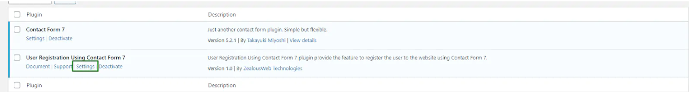

# User Registration Using Contact Form 7 
User Registration Using Contact Form 7 plugin provides the feature to register the user to the website. By using this plugin, it becomes easy to create the registration or sign up form by selecting the fields for username and Email Id. The plugin allows the admins to view the list of registered users and set their roles efficiently.

# PLUGIN REQUIREMENT
- PHP version : 5.4 and latest
- WordPress : WordPress 3.0 and latest

# Installation
Installing the plugin is easy. Just follow these steps:

- From the dashboard of your site, navigate to Plugins –> Add New.
- Select the Upload option and hit “Choose File.”
-  When the popup appears, select the contact-form-7-stripe-addon.zip file from your desktop.
- Follow the on-screen instructions and wait till the upload completes.
- When it’s finished, activate the plugin via the prompt. A message will display confirming activation was successful.

# How To Use

Once you’ve activated the plugin, go to settings page as shown below:

On the settings page, you can view and change the settings for User Registration, as shown below:

- **Select Registration Form**

Select the Form for User Registration.

- **Enable Debug Mode**

Tick the checkbox to enable the debug mode to generate user logs.

- **Skip Contact Form 7 Email**

Tick the checkbox to skip the default contact form 7 email.

- **Select User Role Field**

Select the User Role for user registration.

- **Select Email Field**

Select the field for User Email Address.

- **Select Username Field**

Select the field for Username.

- **Select Success URL**

Select the URL to redirect the users after the registration process is completed.

**Add the Form Shortcode on page:**

Once the settings are saved, please add the form shortcode into a page. The form should be the same that you have selected for the Registration Process.

**Registered User Listing Page:**

This page will list all the users who have been registered using the Contact Form 7 form. You can view the Email, Username, and User Role here.

**Registered User Detail Page:**

Admin can view the registration details from the detail page.

# Getting Help

If you have any difficulties while using this Plugin, please feel free to contact us at opensource@zealousweb.com. We also offer custom WordPress extension development and WordPress theme design services to fulfill your e-commerce objectives. Our professional impas‐ sioned WordPress experts provide profound and customer-oriented development of your project within short timeframes. Thank you for choosing a Plugin developed by ZealousWeb!
